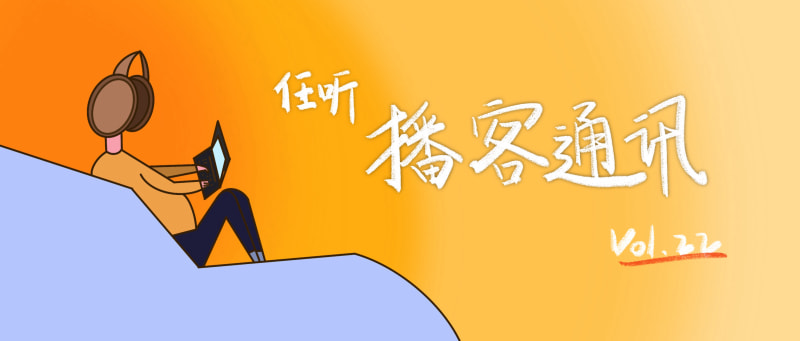

# 任听播客通讯 Vol.022
🍜 边吃边听，乃播客奥义
_本期阅读约需 5 分钟_
_2020-11-09_

## 本期推荐

### 碳水自由？美得你
爆碳一时爽，上秤火葬场。在反对「外貌焦虑」、「过度减肥」已经成为主流声音的今天，突然告诉你如何控制碳水反而成为了一种「高调」。不同于标题，这期播客实质上还是探讨如何与自己的身体相处。当然无论是否减肥、是否控碳都是自己的选择，始终是真理的还是那句老话 ——「身体是革命的本钱」，保持身心健康是第一要务。
#### [饭不着](http://www.ximalaya.com/album/40546459.xml)

### 女生这一辈子，究竟要遭遇多少次性骚扰
社会对于性骚扰（尤其是对于女性的性骚扰）的关注越来越多，即便如此，仍有花样百出的性骚扰困扰着各个年龄段的女性。公司、公共交通、学校、社交软件……在很多男性看来不可能发生性骚扰的地方，都是女性独自作战的「战场」。这些勇敢的女孩们在播客里讲出自己的故事，希望能让其他女孩们更有力量。P.S.顺便安利一本书——《知晓我姓名》，作者是一位有一半华人血统的美国女孩，不幸遭受性侵后她选择让世界知道她的存在。
#### [故事FM](https://storyfm.cn/feed/episodes)

### 唱歌跳舞金腰带-娱乐圈里二三事
这期节目只需要一句话的介绍，就能让你无法拒绝——这是一期直接说真名的娱乐圈大揭秘！不同于以往的哔声连成歌，花局这期节目直呼明星大名，大谈特谈娱乐圈人尽皆知的“平常事”，真真假假一次听个够！
#### [花花局外人](http://rss.lizhi.fm/rss/27718104.xml)

## 随便听听

* 男同更能共情女性还是更厌女？ _「不管是何取向，男女都在被男权社会异化」_
  #### [落选沙龙](https://justpodmedia.com/rss/Salon-des-Refuses.xml)
* 双雪涛对话梁龙：我叫白云我叫黑土，我要孤独我要幸福 _「忧郁写作王子邂逅叛逆老baby，细腻盘道东北文学」_
  #### [随机波动](https://feeds.fireside.fm/stovol/rss)
* 穿衣打扮是为了吸引异性还是同性？  _「其实是为了吸引不想回家继承家产的本期嘉宾」_
  #### [Woo话可说](http://rss.lizhi.fm/rss/171692631.xml)
* 独居青年情绪指北 _「勇敢表达真实的情绪是人类的进步」_
  #### [自思自立Self-ish](https://anchor.fm/s/1302dccc/podcast/rss)
* 生理期，不至于生理 _「生理期的痛，希望男女都懂」_
  #### [发热电台FeverRadio](http://www.ximalaya.com/album/31685444.xml)
* 用声音穿越回广播的第一夜 _「无线电广播原来是来自一个人突发奇想的一次直播」_
  #### [去现场](https://justpodmedia.com/rss/go-live.xml)
* 当结婚、离婚、生育遇到2020年民法典（下）：离婚冷静期，真的有用吗？ _「离婚冷静期保护了哪些人的利益？」_
  #### [沈奕斐的播客](http://www.ximalaya.com/album/42517053.xml)
* 聚到一起聊复古 _「你应该用 New Balance 鞋盒里附送的鞋带，那才是设计师的设计初衷」_
  #### [ULSUM RADIO](http://www.ximalaya.com/album/32978891.xml)
* 再谈星链计划 _「我们离用上平价的卫星互联网还有多远」_
  #### [六爻庚子](https://getpodcast.xyz/data/ximalaya/32742850.xml)

## 播客新声

* 開門見山  _「词人林夕的时局观察」_
  https://open.firstory.me/rss/user/ckguf95ob04cw0843djw74sfj
* 随变聊聊 _「英语老师来聊学习英语」_
  http://www.ximalaya.com/album/41802341.xml
* 惊奇电台  _「科幻作品对当代文化潮流的影响」_
  https://justpodmedia.com/rss/amazing-podcast.xml
* 影像操场  _「我们对电影还能有什么期待」_
  https://www.ximalaya.com/album/39685148.xml
* 特 · 立不独行  _「特斯拉的官方播客」_
  https://getpodcast.xyz/data/ximalaya/39814943.xml
* PSA午夜电台：音浪  _「跟着上海双年展的艺术家一起回响激发他们创作灵感的乐曲」_
  http://www.ximalaya.com/album/41207126.xml
