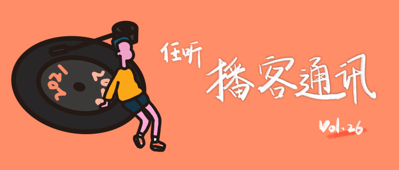

# 任听播客通讯 Vol.026

## 主播们的年终总结

### 能活到2020年尾不容易：本年度总结与精选
也许再过100年，讲述2020年历史课会让学生们十分头疼，需要人类记住的知识点实在太多，多到我们不敢去回顾2020，不敢去畅想2021。身处大洋彼岸的主播和剪辑师们能在2020坚持把播客继续下去也是一件值得被记住的事情。当历史和未来同时向我们涌来，我们能做的最勇敢的事情，恐怕就是珍惜现在。
#### [小声喧哗 LOUD MURMURS](https://loudmurmursfm.com/episodes/feed.xml)

### 《黑镜》主创带你回顾2020:Death to 2020 ｜一周年特辑
作为一档英美剧主题的播客，用美剧总结2020再合适不过了，「Death to 2020」的主创用一部黑色幽默的喜剧总结2020也是再合适不过了。很难说2020到底是上帝的安排还是人类的罪行，当「魔幻」、「惊悚」、「无奈」……等一系列词汇都无法概括刚刚过去的一年时，只能送给TA一句——『去死吧，2020』！
#### [英美剧漫游指南KILLING TV](http://www.ximalaya.com/album/23972017.xml)

## 去年发现的新宝藏

这里汇集了我们在2020年发现并沦陷的「新」播客，可能是刚刚开播的潜力股，也可能是混迹江湖的老炮儿；一句话帮你发现一个新宝藏。

* #### [花花局外人](http://rss.lizhi.fm/rss/27718104.xml) _「全面carry你的政治经济文化生活，主播四人简直东北之光」_
  推荐单集：
  - 唱歌跳舞金腰带-娱乐圈里二三事
  - 国剧经典-你究竟有几个好先生
  - 喷子大舞台-综艺龙虎榜4（上/下）
  - 喷子大舞台-综艺龙虎榜之美国大选
  - 国剧经典-我瞎了眼我看《奋斗》
  http://rss.lizhi.fm/rss/27718104.xml
* #### [展开讲讲](http://www.ximalaya.com/album/24672021.xml) _「日韩剧集和国内综艺也能引发思考，这与看的人有关」_
  推荐单集：
  - 【番外】十一月广播电视报：争当快乐冠军！
  - 《乘风破浪的姐姐》：真人秀、社会议题和女性友谊
  - 没有剧本的《双层公寓》与云端化的当代爱情
  - 从《爱的迫降》到《寄生虫》：当韩国人将一切类型化
  http://www.ximalaya.com/album/24672021.xml
* #### [贤者时间](https://s1.proxy.wavpub.com/marcast/xzsj.xml) _「真诚是藏不住的美好品质，主播的真诚已经溢出耳机啦」_
  推荐单集：
  - 巨大时代里，我们努力过着的小小人生 | 深夜篇
  - 好朋友，我也永远对你好奇｜深夜篇
  - 越长大越肤浅，可我只想躲回童年
  https://s1.proxy.wavpub.com/marcast/xzsj.xml
* #### [老talk消息](http://www.ximalaya.com/album/31225613.xml) _「单口播客也能密集输出观点」_
  推荐单集：
  - 互联网这个媳妇儿要“熬”成婆
  - 骑手的“原子化”，美团的定时炸弹
  - 女人追求完美婚姻，男人拒绝长大
  http://www.ximalaya.com/album/31225613.xml
* #### [隔壁电台](https://s1.proxy.wavpub.com/gebifm.xml) _「相见恨晚的六年老电台」_
  推荐单集：
  - 从69岁老同志开始，聊聊我们该如何老去
  - 希望你开心的听完我和肿瘤的故事
  - 年轻一代的焦虑
  https://s1.proxy.wavpub.com/gebifm.xml
* #### [大小电台](https://s1.proxy.wavpub.com/daxiaodiantai.xml) 「不会录播客的产品经理不是好咖啡师」
  推荐单集：
  - 票证时代:勒紧裤腰带过日子
  - 一天之计在于早餐
  - 你是否也在想念咖啡馆里的背景乐？
  https://s1.proxy.wavpub.com/daxiaodiantai.xml
* #### [反向流行](http://www.ximalaya.com/album/26684396.xml) 「当另类慢慢变为主流，我们需要追随流行么？」
  推荐单集：
  -  饭圈十万个为什么：偶像为何不能谈恋爱？
  -  拍电影的小说家：万玛才旦与他的藏地新浪潮
  - 当代油腻图鉴：社会人的清明上河图
  http://www.ximalaya.com/album/26684396.xml

## 播客回声

* #### [六爻庚子](https://getpodcast.xyz/data/ximalaya/32742850.xml) ： _《科学脱口秀》的那些往事_
  科学脱口秀主播半只土豆、史军作客六爻庚子播客分享做科脱的往事。2020年，播客商业化再掀高潮，行业洗牌在所难免 —— 有被现实消磨殆尽后蛰伏的老播客，也有专业 MCN 涌入后孵化的新播客。作为播客听众，最希望的还是看到百花齐放 —— 不仅要有「专业」的精品店，也要有「不专业」的街边小店。  
  https://getpodcast.xyz/data/ximalaya/32742850.xml

* #### [没友名字的播客｜No Name](http://www.ximalaya.com/album/36246753.xml) ： _友的聊重聚_
  经历过颠沛曲折的N年断更后，友藏、Jaxlee、LeoYang 重新聚在一起，多年之后主播们都在实现着自己的梦想，这可能是对听友最大的宽慰。  
  http://www.ximalaya.com/album/36246753.xml
