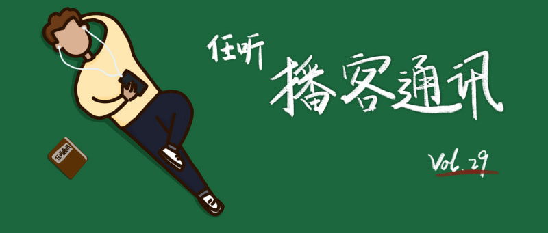

# 任听播客通讯 Vol.029
💾 时代在发展，人类在进步
_本期阅读约需 5 分钟_
_2021-04-09_

## 本期推荐

### 下沉年代：美国是不是不行了
以前总会时不时的滥用「个人命运被时代碾压」这类的话，却很少思考时代到底对自己的有什么影响；也会时不时地觉得，只要过好自己的生活，任他时代的狂风乱吹也可以岿然不动。即便在经历了疫情这类的黑天鹅事件，也没有真正去确认心底挥之不去的不安全感从何而来。在听到这个播客之前看完了这本书，即使讲的是意识形态完全不同的美国的故事，读书期间就觉得似乎找到了个人与时代的某种联系：即使不能改变时代，也可以坚持自己的坚持。而文化有限帮忙总结了更清晰的原则——永远记住：居安思危、不要过度消费、保持冷静和清醒。没有时间看书的话，这期必听！
#### [文化有限](https://s1.proxy.wavpub.com/weknownothing.xml)

### 历史想象中的现代性：屠龙少年如何不变成恶龙？
国际关系的话语逻辑，真的跟私人聊天很像——有时候像是在自言自语的话，其实说给别人听的；有时候说给对方听的话，也有可能是在自我肯定。现在东西方的对立话语体系，其实根基没有人们想象的那么深；东方人在西方眼中的逐渐「黄」化，也不过来源于19世纪，在漫漫历史长河中，微不足道。或许东西方在不同语境下的和谐共处才是历史的终结，只不过那时我们也会成为历史。
#### [双重意识 Double Consciousness](http://www.ximalaya.com/album/43408864.xml)

## 随便听听

* 春日特别企划：朋友，你也减过肥吗? _「我的减肥方案：等社会发展到大众不再审视我们的身体」_
  #### [废柴马拉松](http://www.ximalaya.com/album/43499748.xml)
* 日韩女星离婚苦 五十步来笑百步 _「播客界第一毒奶——节目发布几天后吉濑美智子离婚了」_
  #### [东亚观察局](https://justpodmedia.com/rss/eye-on-east-asia.xml)
* 一位出生/成长/生育在潮汕的女性的自白 _「与潮汕人结婚并没有任何不同」_
  #### [噢！妈妈 | Oh! Mama](https://feeds.buzzsprout.com/1339282.rss)
* 清明特辑之这些年我逛过的欧洲墓园  _「墓地思古」_
  #### [六爻合辑](https://getpodcast.xyz/data/ximalaya/32742850.xml)
* 《关于虚拟币的一切》S1E1：比特币对冲一切？（上）&（下） _「从比特币到NFT，还能上车吗？」_
  #### [墙裂坛【对话/访谈】](https://getpodcast.xyz/data/ximalaya/39420811.xml)
* 中国代孕市场田野调查 _「从田野调查来剖析这个复杂社会议题」_
  #### [纽约文化沙龙](https://nyshalong.com/public/rss/itunes_podcast_rss_feed.xml)
* 伍迪·艾伦性侵疑云再起：艺术家就能免于道德指控吗？ _「艺术行为的边界与道德边界的拉锯」_
  #### [反向流行](http://www.ximalaya.com/album/26684396.xml)

## 播客新声

* 大声调频 | 丁太升毒舌开聊  _「在热搜的漩涡力尽兴聊音乐、聊娱乐」_
  https://getpodcast.xyz/data/ximalaya/47891070.xml
* 粉笔公社 _「在职新东方老师的脱口秀养成」_
  http://www.ximalaya.com/album/48143951.xml
