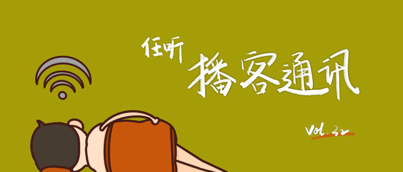

# 任听播客通讯 Vol.032

## 本期推荐

### 离开互联网我在北京生活了九天
这是一期「流水账」式的生活记录，但是我从未如此期待过观察别人的生活。告别互联网的生活甚至无法想象，但是主播乐先生却在北京进行了一场「盛大的」社会实验。仅仅是不能获取信息或者没有娱乐还能接受，但是在吃饭、缴纳电费、公交出行都受到影响的情况下，还能坚持九天的挑战，不得不佩服乐先生的勇气和智慧。十几年前，有电视台曾经做过「只用互联网生活」的挑战，而今天不用互联网也成了挑战，互联网给我们带来了什么，又带走了什么，可能只有亲自「挑战过」才知道。
#### [花市电台](https://s2.proxy.wavpub.com/fancyradio.xml)

### 我先生是渐冻人
几年前，互联网上流行的冰桶挑战让「渐冻症」走进了我们的视野；如今，热度退去，最为人熟知的患者霍金也去了另一个平行时空，渐冻症患者的真实生活是什么样的？这期的嘉宾王老师，是渐冻症公益组织的志愿者，也是渐冻症患者的家属。渐冻症对个人和家庭的打击是近乎毁灭性的，十几年如一日的相互搀扶，让王老师和丈夫彤哥的故事令人动容。当灾难降临，爱是我们最后的武器。
#### [发发大王](https://s2.proxy.wavpub.com/fafadawang.xml)

## 随便听听

* 欧洲杯球队介绍系列 _「虽然不看足球，但是知识还是要学习」_
  #### [小熊喝甜粥](https://getpodcast.xyz/data/163/2733001.xml)
* 留守在家乡的父母：我通过微信运动观察儿女的生活痕迹 _「默默关心的父母和假装努力生活的儿女，都让人心酸」_
  #### [箭厂电台](http://www.ximalaya.com/album/46595297.xml)
* 前男友是我失散多年的亲人 _「虽然不同意他们说的关于前任关系的每一句话，但是还是值得听一听」_
  #### [Slightly Open](http://www.ximalaya.com/album/41122318.xml)
* 和鲁豫聊聊我们不信的那些事  _「真的吗？我不信」_
  #### [落选沙龙](https://justpodmedia.com/rss/Salon-des-Refuses.xml)
* Moon：婚礼现场一半是脱口秀演员，一半是警察 _「荒谬当道，爱拯救之」_
  #### [基本无害 Mostly Harmless](https://feeds.acast.com/public/shows/5eb54e984daf164a540fabdf)
* 如何优雅地吐槽 logo 设计 _「设计评价是玄学吗？」_
  #### [现在进行时](http://www.ximalaya.com/album/40159997.xml)
* 恐怖如何成为神？艺术背后的克苏鲁 _「影视中克苏鲁滥觞的肇始」_
  #### [影像操场](http://www.ximalaya.com/album/39685148.xml)
* 去读电竞班的热血少年，后来怎样了？ _「电竞职业会是个梦想职业吗」_
  #### [反潮流俱乐部](https://feeds.fireside.fm/fanchaoliuclub/rss)
* 野生动物频繁“进城”：我们如何想象人与动物的新未来？ _「人类与野生动物关系的重新定义」_
  #### [反向流行](http://www.ximalaya.com/album/26684396.xml)
* 被网暴后，我的互联网生存指南 _「沈教授现身说法」_
  #### [沈奕斐的播客](https://feed.xyzfm.space/99b3wkblwf9c)
* 阿拉斯加旅游 _「不能出境的2021用耳朵漫游世界」_
  #### [牛油果烤面包](http://www.ximalaya.com/album/29161862.xml)

## 播客新声

* 许知远的内心旅行 _「人生何处不相逢的」_  
  http://www.ximalaya.com/album/49899233.xml
* 螺丝在拧紧 _「单读主编吴琦与年轻人的文化讨论」_  
  http://www.ximalaya.com/album/47008946.xml
