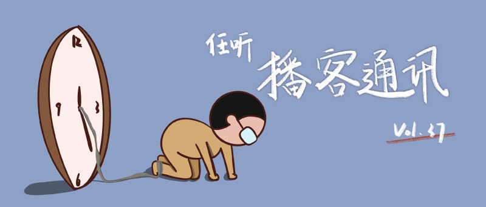

# 任听播客通讯 Vol.037
🧎‍♂️ 对不起，已经不能用拖更来形容我们的行为了
_本期阅读约需 8 分钟_
_2022-03-11_

## 本期推荐

### 寻找10万张老照片中的历史记忆 ft.邹德怀
1945年4月28日，瑞典马尔默港，在纳粹战败的前夜，一批被解救的集中营受害者将从这里走向新的生活，而在一张一张满溢幸福的笑脸中间，有一位中国面孔，冷漠的冲着镜头发出了似乎带着一些不屑的笑——这位女士名叫Natine Hwang黄讷亭，她的传奇经历都在这冷漠背后，此后的几十年间，不止一个人寻找过她的故事——有法国作家、有瑞典纪录片导演，还有中国的老照片收藏者邹德怀。历史的浓雾下，个人的命运很容易消散，即使是像Natine Hwang这样家世显赫、能力拔群的人也不例外，只希望像邹德怀这样的好奇心可以越来越多，让更多的普通人的历史被还原。
同时邹德怀团队也做了一个视频，建议先看再听。 https://www.bilibili.com/video/BV1UR4y1M7u7
#### [TIANYU2FM — 对谈未知领域](http://www.ximalaya.com/album/40320716.xml)

### 东东枪宇宙
这部分推荐的不是一个播客，而是新世界的大门。东东枪是谁？百度百科说「东东枪，本名郝连会，男，1982年生，天津人。文字/创意工作者，个体创作者，各种爱好者」。而在播客里，我们知道他是「宇宙牌电饭锅」的主播，是「基本无害」毛冬的前领导，是经常串台的知名「游民」，是人间清醒「和菜头」的老友……总之只要你听播客，一不小心就会走入东东枪宇宙，一个人有多重身份不奇怪，但一个人能做到处处可见一定是有点东西。
#### [宇宙牌电饭锅](https://feeds.acast.com/public/shows/dongdongqiang)： _「小孩大会」之 「我们的金钱观」_
#### [无聊斋](http://www.ximalaya.com/album/14302859.xml)：_在生活的一面面旗帜前有没有失去方向_
#### [文化有限](https://s1.proxy.wavpub.com/weknownothing.xml)：_中年人的爱情是？｜东东枪串台_
#### [看理想电台](https://api.vistopia.com.cn/rss/program/13.xml)：_15年来，我包里都带着这几样东西 | 东东枪来了_

## 随便听听

* 和踩铃聊金庸：周芷若的主要问题是没有正能量 _「现在回忆一下，周芷若可能真的是矫情届的扛把子」_
  #### [基本无害 Mostly Harmless](https://feeds.acast.com/public/shows/5eb54e984daf164a540fabdf)
* 经济学小品：swift系统与经济制裁 _「希望大家都能先学习再上网，与君共勉」_
  #### [维生素E|经济学与哲学知识分享](http://www.ximalaya.com/album/19758469.xml)
* 手把手带你相亲成功 _「秘诀就是：让对方感受不到在相亲，但自己一直记得是在相亲」_
  #### [花花局外人](http://www.ximalaya.com/album/20341384.xml)
* 石老板：单立人五周年，喜剧的Calling依然在 _「看一年一度喜剧大赛的时候，每当镜头扫过石老板，总有种莫名的骄傲」_
  #### [日谈公园](http://www.ximalaya.com/album/5574153.xml)

## 播客新声
* 沪外野餐 _「装作是上海中产，装作在户外野餐」_
  https://getpodcast.xyz/data/163/971708159.xml
