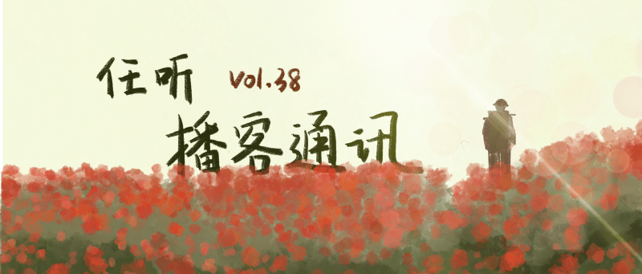

# 任听播客通讯 Vol.038

## 本期说明

没有更新的日子里，偶尔有一丝不安闪过，但整体还是在安然自得地拖更，直到在后台收到越来越多的催更留言。
为了证明我们并没有停更，只不过是一拖再拖，再拖，拖……今天打算写一个特别放送——把我们没有更新这段时间看的剧和播客中聊得比较深入的单集对应起来，搞一个联动。
我个人很喜欢听影视评论类播客，除了可以「复习」自己看片时候没有注意到的细节，主播们的很多观点也可以带来更加深入的思考。以往我们也多次推荐了影视评论的播客，但是很少聊与我们看过的影视链接起来，本次就「不务正业」地同时推荐一期影视和播客。

## 韩剧《浪漫的体质》

### 为什么对冷门的《浪漫的体质》如此推崇？这是一部我们都想拍但拍不出来的电视剧

「展开讲讲」是我们推荐过无数次的播客，而这一期是我爱上「展开讲讲」的起点，这期播客发布于 2019 年 9 月 7 日，《浪漫的体质》也是首播于 2019 年 8 月 9 日的「老韩剧」了，之所以还想推荐，是因为我最近启动了第 4 次观看计划。这部电视剧可以说是「韩国的热搜剧」，但是「热搜剧」这个词在这里绝无任何贬义，它让我看到了另一种可能——就算是堆砌段子和金句，也能让观众与人物共情，也能调动观众的多重情绪，也能让观众意犹未尽。这部剧甚至让我在看到这期播客之前就产生了一种不理性的想法——推崇这部剧的主播，能处！完整地听完了这期播客，我真正的爱上了「展开讲讲」，三位主播甚至比我更爱这部剧，对于人物和剧情的剖析也深刻又亲切，如果这一期节目不是我听到的第一期，我也会爱上「展开讲讲」。

#### [展开讲讲](http://www.ximalaya.com/album/24672021.xml)

## 漫威剧集《月光骑士》

### 《月光骑士》：这个时代会给我们什么样的超级英雄？

漫威重启真正意义上的第一个超级英雄终于来了。虽然在月光骑士之后又出了惊奇少女、女浩克等剧集，但跟月光骑士比起来都差点意思。来自中东地区的月光骑士有着非凡的魅力——神秘莫测的文化源头、令人怜惜的身世背景，不光是马克让人欲罢不能，连一门心思到处找人附身的孔苏都贱得可爱。看完只想说：奥斯卡欠奥斯卡一尊奥斯卡。
北方公园这一集，回归漫威剧本身，没有特别着墨于主角的多重人格，而是探讨月光骑士在漫威时间线上的独特地位，有一些影迷向，但是对于情节和人物关系也会聊得更加深入。

#### [北方公园NorthPark](http://rss.lizhi.fm/rss/100588506.xml)

## 电影《NOPE》

### 《NOPE》：当你凝视深渊时，深渊也在凝视你

虽然被打上了惊悚的标签，但是这部电影恐怖之处更多来源于「细思极恐」。人类自以为征服了一切，但是在未知面前还是丑态百出。电影中从「凝视」和「奇观」出发，给到了一个贯穿始终的奇妙的互文（是什么我不说），以证明人类的羸弱又坚定。两位主播也从各自的角度出发，描述了自己的「观后感」，乍听起来有一些「过分解读」嫌疑，但是观后感不就是个人想法的无限延伸么。

#### [美西螈与东方巨龙](https://anchor.fm/s/23c71f28/podcast/rss)

## 网飞剧集《德尔托罗的奇思妙想》

### 《德尔托罗的奇思妙想》太好看了！/太荒诞了！（是两个单集）

本期节目以剧透电视剧情节为主，而且剧透得相当有画面感，能把恐怖单元剧解说得如此详细，也只有黑水能做到了。说实话，截至发稿之前，我们还没有完整看完这部剧，最主要的原因是这部剧高能场面太多，视觉冲击过于强烈，一度让人满地打滚，工作日晚上看令人疲惫。但是既然黑水用了整整两期来聊，并且标题都是颇具「煽动性」的感叹号结尾，那我相信最后我们还是会看完的。

#### [黑水公园](http://www.ximalaya.com/album/3558668.xml)

## 随便听听

* 给欧洲“送温暖”，靠的不是电热毯 _「靠段子并不能占领欧洲市场」_
  #### [商业就是这样](http://www.ximalaya.com/album/46587439.xml)
* 美日同盟：被秘密统治这件事情 时间久了也会习惯的 _「日本——非正常国家——的统治机制」_
  #### [东亚观察局](https://feed.xyzfm.space/eye-on-east-asia)
* 加沙地带，地球黑洞，真正的巴勒斯坦 _「亲身进入神秘又危险的加沙地带探访」_
  #### [禁止携带](https://feed.xyzfm.space/hl9jj7gdff3q)
* 兰亭神话：王羲之和一场公元四世纪的存在主义思考 _「书圣的复杂一生」_
  #### [剧谈社｜翻译艺术品](http://www.ximalaya.com/album/43127335.xml)
* 想要发电，要先有电：一个总工在中国和非洲修水电站的故事 _「中国水电站的哭墙」_
  #### [晚点聊 LateTalk](https://feeds.fireside.fm/latetalk/rss)
* 大国的尘埃 - 乌克兰（上、中、下） _「乌克兰悲剧肇始」_
  #### [加州 101](http://rss.lizhi.fm/rss/894383.xml)
* 《开局的终局》引进片·第二章、哑谜 _「一家之言：电影引进片只是『符合服务外交外宣工作大局』的工具？」_
  #### [四季办公室](https://siji.typlog.io/feed/audio.xml)
* 重新认识“年轻老人”：当老龄化成为常态，人类身心如何重新安放 _「年轻老人这个概念很好，创造条件让他们更好地从事老年领域的服务活动」_
  #### [墙裂坛](http://www.ximalaya.com/album/39420811.xml)

## 播客新声

* 一手故事 _「多样、真实的故事」_  
  https://open.firstory.me/rss/user/cl45s0e8w056k01w94iqq4m0u
* 理性批判 _「用思想的钥匙打开世界」_  
  https://feed.xyzfm.space/vqpjjxnrtbdr
