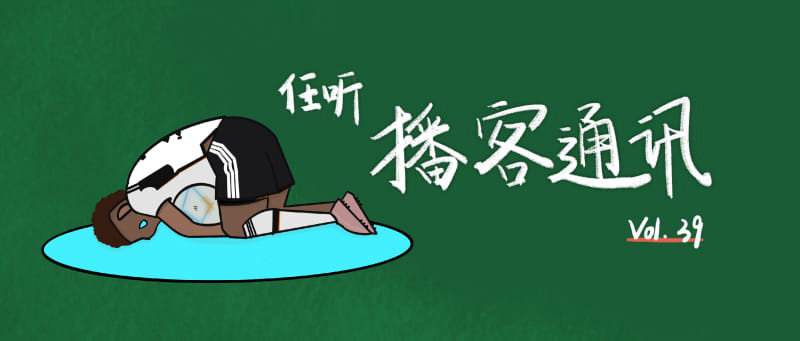

# 任听播客通讯 Vol.039

## 本期说明
着手写这篇推送的时候，世界杯小组赛已经结束，即使仅仅拥有浅薄的足球知识，也能看出炎热的卡塔尔爆了不少冷。这已经是我「只在世界杯期间看球」的第三届，虽然没有像前两届一样守在电视机前（一种古早的说法）见证我喜欢的队伍提前回家、我喜欢的球员泪流满面，但是这段时间听了不少聊足球的播客。虽然我是伪球迷，但是我是真听播客啊。

## 世界杯单集播客推荐

### 2022卡塔尔世界杯看点前瞻
前瞻节目已经成为结婚节目的老牌劲旅，今年这期之后，三位老师竟然要上线「跟每届世界杯都结婚」企划了。结婚节目不用过多推荐，一如既往的稳定输出，三位小将老师不管在体能（时长）还是技术方面都是本届世界杯上的耀眼新星。其中我最喜欢的环节，当属世界杯帅哥盘点，遥想2018年，因为听了结婚节目关注了法国队右后卫帕瓦尔，结果没想到法国队直接捧杯，帕瓦尔的一脚世界波更是成为当年的最佳进球，并让自己的身价多了一个0。往事不堪回首，三位小将老师的解说精彩依旧。
#### [跟宇宙结婚](http://rss.lizhi.fm/rss/1307862.xml)

### 世界杯｜第二轮既靠大哥也靠嫂子
虽说跑题大会的世界杯系列的预测准确度低了点，但是这期八卦内容真的是搅动起了我的DNA。作为一个不明真相的伪球迷，实在是很难想象比曹魏更爱人妻的只有阿根廷足球运动员。不过很多事情就像早恋，不怕少男少女情窦初开，就怕内心波澜影响学习。
#### [跑题大会](http://www.ximalaya.com/album/14641355.xml)

### 他们的世界杯，我们的世界杯
本期全是感情，没有技术（不是说没有技术不好的意思）。李加州指导中期选举之后终于归位，四位男主播畅聊关于世界杯的回忆。主播中有从小踢球的资深业余爱好者，有跟「力克国足的县大队平级的球队」抢名字的赞助人，有足球世家少主的同桌，播客中更是慢慢的对历届世界杯的回忆。千言万语汇成一句话——中国足球，对不起逃课去看球的中国球迷。
#### [花花局外人](http://www.ximalaya.com/album/20341384.xml)

### 大空を飛ぶ翼！日本人用30年实现了《足球小将》的梦想
本届我第一场完整看完的比赛，就是德国对日本的小组赛。日本踢赢德国虽然不能说爆冷，但是也是日本队的历史时刻。回顾20年来日本足球发展史，今天的结果是巧合也是必然。而在这之后的比赛中，日本再次赢得西班牙，以小组第一的成绩出线，成为妥妥的亚洲之光（免责声明：不考虑这个光是不是借来的）。不得不说：欧洲球队先输日本再输韩国，这样下去是要输越南的。
#### [东亚观察局](https://feed.xyzfm.space/eye-on-east-asia)

### 足球审美和英雄气概，真的男女有别吗？
作为一个只看世界杯的伪球迷，平时不看足球除了没有「氛围感」，还有一个很重要的理由就是，我认为现在主流足球比赛（很遗憾，是男足比赛）是我心中标准的「男权温床」，它几乎聚集一切流向男性的资源——身体优势、胜负欲、金钱、权利……与此同时，观看足球的女性往往会被冠以「向往男性魅力（俗称看脸）」的名号。世界杯观战过程中，也有几次跟男性球迷关于这些问题的讨论，而本期播客怎是更加全面地探讨了不同性别的「足球审美」。听完之后我也要调整一下对比赛的认识了。
#### [鹰眼时间·世界杯特别版](https://feed.xyzfm.space/4cdjkbgjkcrd)

<!-- roam -->
## 体育类播客推荐
* 虽说不支持把什么名词前都加上「女」字，但是女性球迷的视角的确大为不同
  #### [从球说起｜女球迷的人间观察](https://s1.proxy.wavpub.com/beyondfootball.xml)
* 并不是全部主题都与体育相关，但是主播刀老师就是这个星球上的足球百科全书！
  #### [小熊喝甜粥](https://getpodcast.xyz/data/163/2733001.xml)
* 世界杯观后感就像写日报，光是在现场这一点，绩效就值得给一个S+
  #### [足球咖啡馆 Football Café 世界杯早咖](http://www.ximalaya.com/album/39304323.xml)
